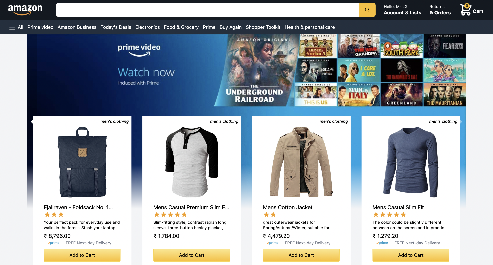
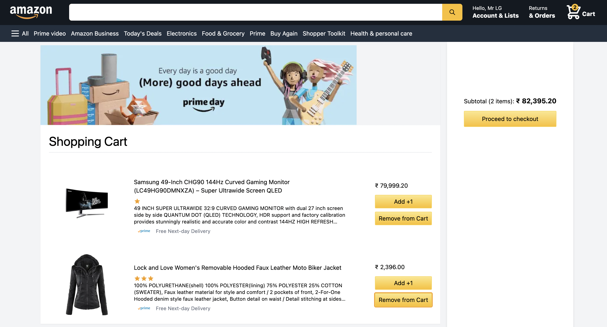
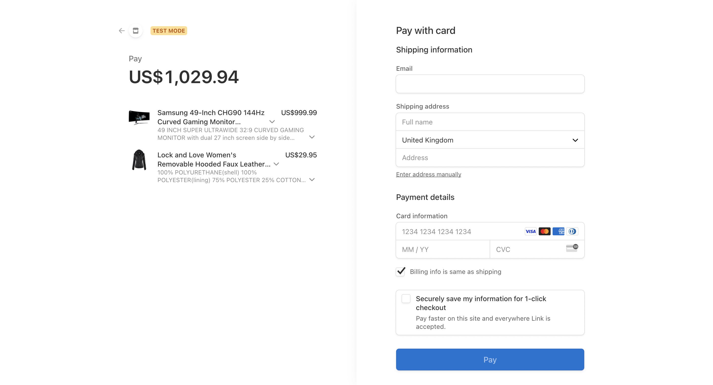
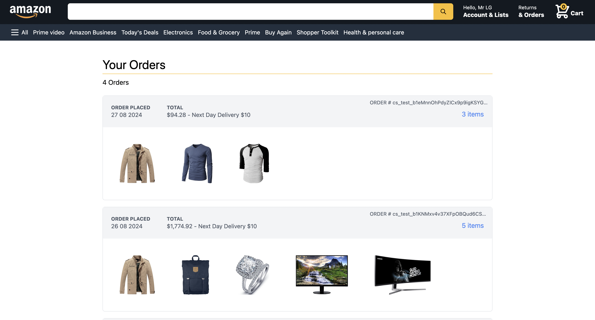
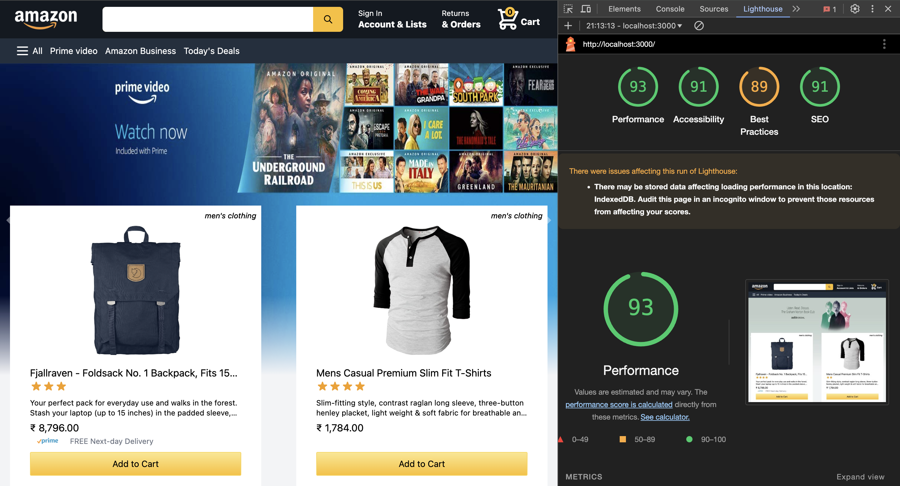

# E-Commerce Platform with Google Authentication, FakestoreAPI, and Stripe Integration

## Project Overview

This project is a fully functional e-commerce platform with features such as secure Google authentication, dynamic product population from FakestoreAPI, a replica of Amazon's UI design, and a Stripe payment gateway for seamless transaction handling. Payment and order details are stored in Firebase using Stripe webhooks.

## Features

### 1. **Populated Store Products (FakestoreAPI)**
Products are dynamically populated using **FakestoreAPI**, providing a variety of items for users to browse.

 

### 2. **Amazon eCommerce UI (Tailwind CSS)**
Achieved a pixel-perfect **Amazon eCommerce UI** using **Tailwind CSS**, ensuring a familiar and intuitive user experience.

### 3. **Google Authentication (NextAuth)**
Integrated Google authentication using **NextAuth** for easy and secure sign-in, ensuring a smooth user login experience.

### 4. **Stripe Payment Gateway Integration**
Integrated **Stripe payment gateway** to handle secure customer transactions. Payment and order details are captured for future reference.

### 5. **Stripe Webhooks and Firebase Integration**
Utilized **Stripe webhooks** to store customer payments and order details in **Firebase**, which are later displayed on the user's orders page.

### 6. **Performance Optimization**
Achieved an exceptional 93% performance score in Lighthouse testing by optimizing the platform for speed, accessibility, and best practices. 

## Technologies Used
- **Next.js** for server-side rendering and routing
- **NextAuth** for authentication
- **FakestoreAPI** for populating store products
- **Tailwind CSS** for styling
- **Stripe API** for payment processing
- **Firebase** for database and storage
- **Stripe Webhooks** for order tracking and storage

## Deployment
The platform is deployed on Vercel. You can check it out here: [E-Commerce Platform](https://my-amazon-iota-ten.vercel.app)
